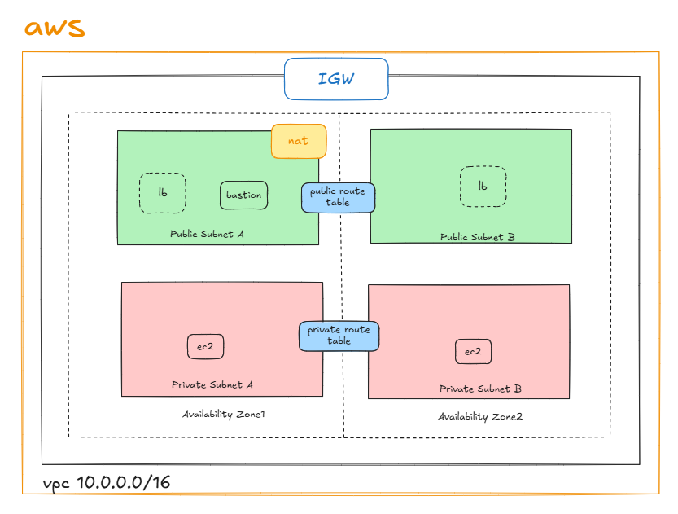

# Terraform Infrastructure Project

This repository contains Terraform configuration files for deploying cloud infrastructure.

## Architecture Overview



## Project Structure

```
.
├── main.tf              # Main Terraform configuration
├── vpc.tf               # VPC and networking resources
├── sg.tf                # Security groups configuration
├── instance.tf          # EC2 instances configuration
├── keypair.tf           # SSH key pair configuration
├── deployer-key         # SSH private key (not committed)
├── deployer-key.pub     # SSH public key (not committed)
├── terraform.tfstate    # Terraform state file (not committed)
├── cmd.txt              # Command reference (not committed)
└── .gitignore           # Git ignore rules
```

## Prerequisites

- [Terraform](https://www.terraform.io/downloads.html) >= 1.0
- AWS CLI configured with appropriate credentials
- SSH key pair for EC2 access

## Getting Started

### 1. Clone the Repository

```bash
git clone <repository-url>
cd terraform-ja
```

### 2. Initialize Terraform

```bash
terraform init
```

### 3. Plan the Deployment

```bash
terraform plan
```

### 4. Plan the Deployment

```bash
terraform plan
```

### 5. Apply the Configuration

```bash
terraform apply
```

Type `yes` when prompted to confirm the deployment.

### 6. Access Your Infrastructure

After successful deployment, you can access your EC2 instances using the SSH key:

**Direct access to public instances:**
```bash
ssh -i deployer-key ubuntu@<instance-public-ip>
```

**Access via bastion host (for private instances):**
```bash
# First, SSH to the bastion host
ssh -i deployer-key ubuntu@<YOUR_BASTION_IP>

# Then from the bastion host, SSH to private instances
ssh -i deployer-key ubuntu@<private-instance-ip>
```

## Configuration Files

### main.tf
Contains the main Terraform configuration including provider settings and basic resource definitions.

### vpc.tf
Defines the Virtual Private Cloud (VPC) and associated networking components:
- VPC
- Subnets
- Internet Gateway
- Route Tables

### sg.tf
Security group configurations for controlling network access to resources.

### instance.tf
EC2 instance configurations including:
- Instance specifications
- AMI selection
- Security group associations
- Key pair assignments

### keypair.tf
SSH key pair configuration for secure access to EC2 instances.

**Note**: Before deploying, make sure to update the `public_key` value in this file with your own public key generated from the SSH key generation step above. The current public key in the file should be replaced with the contents of your `deployer-key.pub` file.

## Important Notes

- **State Files**: Terraform state files contain sensitive information and should never be committed to version control.
- **SSH Keys**: Private keys are excluded from git commits for security reasons.
- **Variables**: Consider using `.tfvars` files for environment-specific configurations.

## Cleanup

To destroy the infrastructure when no longer needed:

```bash
terraform destroy
```

Type `yes` when prompted to confirm the destruction.

## Security Considerations

- Always review the Terraform plan before applying changes
- Keep your AWS credentials secure and follow the principle of least privilege
- Regularly rotate SSH keys and access credentials
- Monitor your AWS costs and resources

## Contributing

1. Fork the repository
2. Create a feature branch
3. Make your changes
4. Test thoroughly
5. Submit a pull request

## Support

For questions or issues, please refer to the [Terraform documentation](https://www.terraform.io/docs/) or create an issue in this repository.

## License

This project is licensed under the MIT License - see the LICENSE file for details.